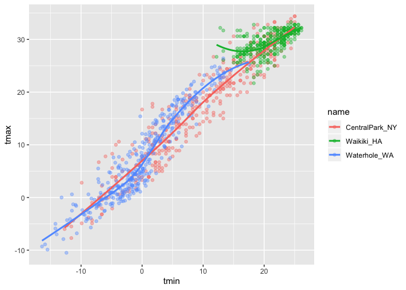
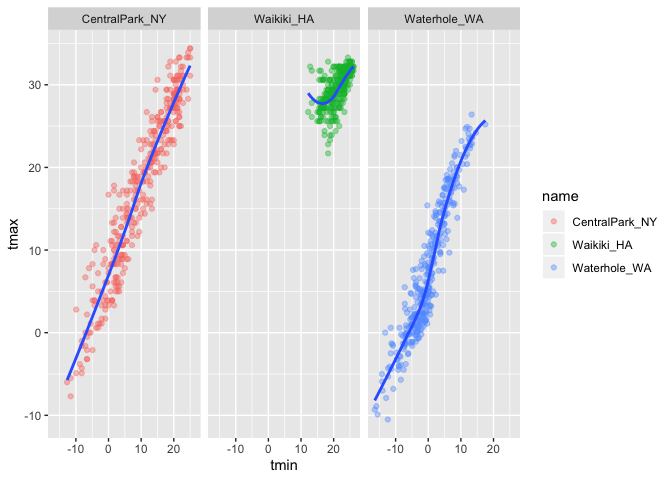
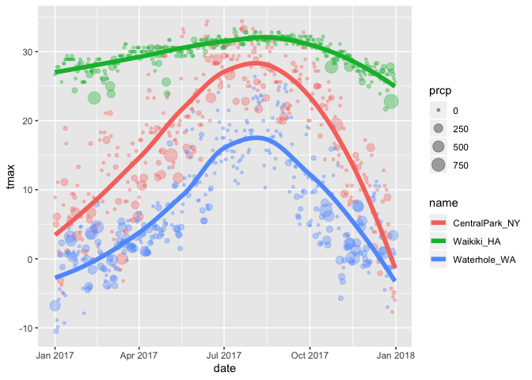
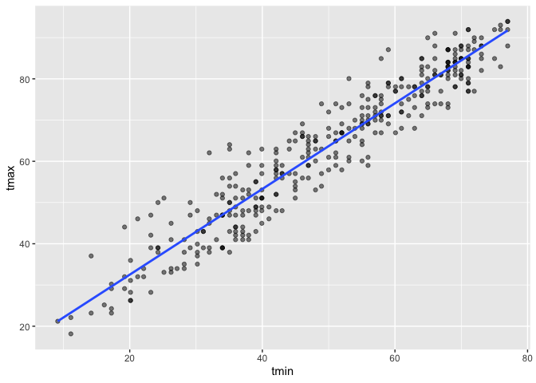
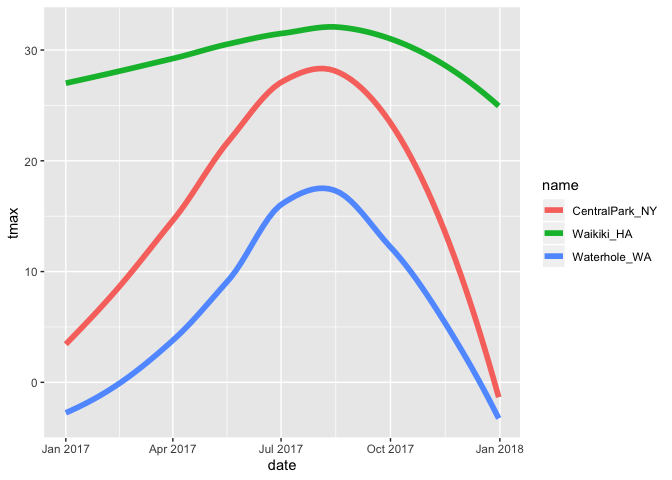
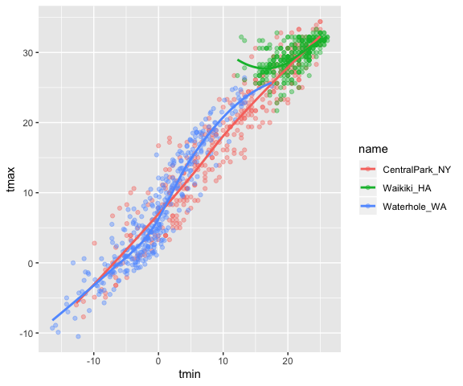
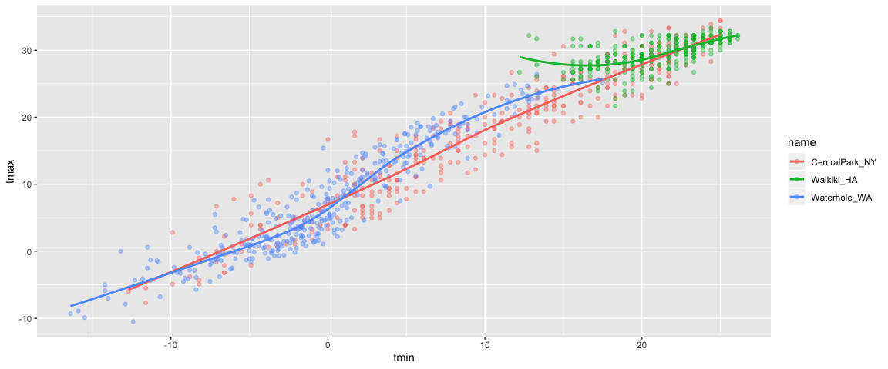

‘ggplot’ 1
================
Katie
10/12/2019

## Create the weather data

``` r
weather_df = 
  rnoaa::meteo_pull_monitors(c("USW00094728", "USC00519397", "USS0023B17S"),
                      var = c("PRCP", "TMIN", "TMAX"), 
                      date_min = "2017-01-01",
                      date_max = "2017-12-31") %>%
  mutate(
    name = recode(id, USW00094728 = "CentralPark_NY", 
                      USC00519397 = "Waikiki_HA",
                      USS0023B17S = "Waterhole_WA"),
    tmin = tmin / 10,
    tmax = tmax / 10) %>%
  select(name, id, everything())
```

    ## Registered S3 method overwritten by 'crul':
    ##   method                 from
    ##   as.character.form_file httr

    ## Registered S3 method overwritten by 'hoardr':
    ##   method           from
    ##   print.cache_info httr

    ## file path:          /Users/katiegao/Library/Caches/rnoaa/ghcnd/USW00094728.dly

    ## file last updated:  2019-10-12 11:31:05

    ## file min/max dates: 1869-01-01 / 2019-10-31

    ## file path:          /Users/katiegao/Library/Caches/rnoaa/ghcnd/USC00519397.dly

    ## file last updated:  2019-10-12 11:31:20

    ## file min/max dates: 1965-01-01 / 2019-10-31

    ## file path:          /Users/katiegao/Library/Caches/rnoaa/ghcnd/USS0023B17S.dly

    ## file last updated:  2019-10-12 11:31:25

    ## file min/max dates: 1999-09-01 / 2019-10-31

``` r
weather_df
```

    ## # A tibble: 1,095 x 6
    ##    name           id          date        prcp  tmax  tmin
    ##    <chr>          <chr>       <date>     <dbl> <dbl> <dbl>
    ##  1 CentralPark_NY USW00094728 2017-01-01     0   8.9   4.4
    ##  2 CentralPark_NY USW00094728 2017-01-02    53   5     2.8
    ##  3 CentralPark_NY USW00094728 2017-01-03   147   6.1   3.9
    ##  4 CentralPark_NY USW00094728 2017-01-04     0  11.1   1.1
    ##  5 CentralPark_NY USW00094728 2017-01-05     0   1.1  -2.7
    ##  6 CentralPark_NY USW00094728 2017-01-06    13   0.6  -3.8
    ##  7 CentralPark_NY USW00094728 2017-01-07    81  -3.2  -6.6
    ##  8 CentralPark_NY USW00094728 2017-01-08     0  -3.8  -8.8
    ##  9 CentralPark_NY USW00094728 2017-01-09     0  -4.9  -9.9
    ## 10 CentralPark_NY USW00094728 2017-01-10     0   7.8  -6  
    ## # … with 1,085 more rows

## Create a ggplot

``` r
## there are three things you need to make a plot: 
## 1. the dataset itself
## 2. what's going to be on the x- and y-axes
## 3. what kind of a plot to make

ggplot(weather_df, aes(x = tmin, y = tmax)) + 
  geom_point() 
```

    ## Warning: Removed 15 rows containing missing values (geom_point).

<!-- -->

## Alternate way of making this plot

``` r
weather_df %>% 
  ggplot(aes(x = tmin, y = tmax)) + 
  geom_point() 
```

    ## Warning: Removed 15 rows containing missing values (geom_point).

<!-- -->

## Saving initial plots (Jeff mostly doesn’t do it this way)

``` r
scatterplot = 
weather_df %>% 
  ggplot(aes(x = tmin, y = tmax)) + 
  geom_point() 

scatterplot 
```

    ## Warning: Removed 15 rows containing missing values (geom_point).

<!-- -->

## Adding color

``` r
## different aesthetic mappings 
weather_df %>% 
  ggplot(aes(x = tmin, y = tmax)) + 
  geom_point(aes(color = name), alpha = .4)  
```

    ## Warning: Removed 15 rows containing missing values (geom_point).

<!-- -->

``` r
## alpha blending adds transparency to different elements of your plot
## 0 is completely transparent, 1 is not transparent at all 
```

## Why does ‘aes’ position matter?

Here’s the first
plot:

``` r
## creates a smooth curve that goes through the middle of all of the data points
## the color aesthetic mapping only applies to the place where you define that color aesthetic mapping 
## the color aesthetic mapping for this plot is defined only in geom_point

weather_df %>% 
  ggplot(aes(x = tmin, y = tmax)) + 
  geom_point(aes(color = name), alpha = .4) + 
  geom_smooth(se = FALSE)  
```

    ## `geom_smooth()` using method = 'gam' and formula 'y ~ s(x, bs = "cs")'

    ## Warning: Removed 15 rows containing non-finite values (stat_smooth).

    ## Warning: Removed 15 rows containing missing values (geom_point).

<!-- -->

``` r
## geom_smooth(se = FALSE) turns off the gray uncertainty band (aka standard error) around the line
```

vs.

The second
plot:

``` r
## this makes 3 different colored smooth curves for each of the locations
## the color aesthetic mapping is defined everywhere in the plot 
## the result is that both the individual points are colored and the smooth curves from geom_smooth are colored to group-specific colors
## so color is now applied everywhere 

weather_df %>% 
  ggplot(aes(x = tmin, y = tmax, color = name)) + 
  geom_point(alpha = .4) + 
  geom_smooth(se = FALSE)  
```

    ## `geom_smooth()` using method = 'loess' and formula 'y ~ x'

    ## Warning: Removed 15 rows containing non-finite values (stat_smooth).

    ## Warning: Removed 15 rows containing missing values (geom_point).

<!-- -->

## Time to facet\!

We want to take this one panel plot and turn it into a three panel plot,
where each of the panels is its own weather
station.

``` r
## creates 3 smooth lines that are the same color as the locations so is kinda hard to see
weather_df %>% 
  ggplot(aes(x = tmin, y = tmax, color = name)) + 
  geom_point(alpha = .4) + 
  geom_smooth(se = FALSE) + 
  facet_grid(~name)
```

    ## `geom_smooth()` using method = 'loess' and formula 'y ~ x'

    ## Warning: Removed 15 rows containing non-finite values (stat_smooth).

    ## Warning: Removed 15 rows containing missing values (geom_point).

<!-- -->

``` r
## facet_grid will create a grid of individual panels; (~name) means we want that variable to be in the columns 

## the code below creates 3 smooth lines that stand out better amongst the locations and is easier to see  
weather_df %>% 
  ggplot(aes(x = tmin, y = tmax)) + 
  geom_point(aes(color = name), alpha = .4) + 
  geom_smooth(se = FALSE) + 
  facet_grid(~name)
```

    ## `geom_smooth()` using method = 'loess' and formula 'y ~ x'

    ## Warning: Removed 15 rows containing non-finite values (stat_smooth).
    
    ## Warning: Removed 15 rows containing missing values (geom_point).

<!-- -->

## This is fine. But not interesting.

``` r
## what's the seasonal trend in each of these locations? 
## date vs. max temp 
## change inside geom_point the aesthetic mapping so that size=precipitation
## so we get both info about temperature and amount of precipitation on any particular day 
## make alpha .35 to make the indvl points fade into the background a bit 

weather_df %>% 
  ggplot(aes(x= date, y = tmax, color = name)) + 
  geom_point(aes(size = prcp), alpha = .35) + 
  geom_smooth(size = 2, se = FALSE)   
```

    ## `geom_smooth()` using method = 'loess' and formula 'y ~ x'

    ## Warning: Removed 3 rows containing non-finite values (stat_smooth).

    ## Warning: Removed 3 rows containing missing values (geom_point).

<!-- -->

Learning Assessment: Write a code chain that starts with weather\_df;
focuses only on Central Park, converts temperatures to Fahrenheit, makes
a scatterplot of min vs. max temperature, and overlays a linear
regression line (using options in geom\_smooth()).

``` r
## My solution 
weather_df %>% 
  filter(name == "CentralPark_NY") %>% 
  mutate(
    tmax = (tmax * 9 / 5) + 32, 
    tmin= (tmin * 9 / 5) + 32) %>% 
ggplot(aes(x = tmin ,y = tmax)) +
  geom_point(alpha = .5) +
  geom_smooth(method = "lm", se = FALSE) 
```

<!-- -->

``` r
## Answer Key Solution  
weather_df %>% 
  filter(name == "CentralPark_NY") %>% 
  mutate(tmax_fahr = tmax * (9 / 5) + 32,
         tmin_fahr = tmin * (9 / 5) + 32) %>% 
  ggplot(aes(x = tmin_fahr, y = tmax_fahr)) +
  geom_point(alpha = .5) + 
  geom_smooth(method = "lm", se = FALSE)
```

<!-- -->

## Some extra stuff

``` r
## Don't need to always have the same 'geom_' functions, can choose what you want
weather_df %>% 
  ggplot(aes(x= date, y = tmax, color = name)) + 
  geom_smooth(size = 2, se = FALSE)
```

    ## `geom_smooth()` using method = 'loess' and formula 'y ~ x'

    ## Warning: Removed 3 rows containing non-finite values (stat_smooth).

<!-- -->

``` r
## Without 'geom_point,' there's no scatterplot but we can still see the smooth curves 
## When defining ggplots, you can pick and choose the things you want to show and that are the most useful to you 
```

## 2D density

``` r
## if using 'hex' need to install hexbin first 
## install.packages("hexbin")
## weather_df %>% 
##   ggplot(aes(x = tmin, y = tmax)) + 
##   geom_hex() 

## this will give us a 2D scatterplot since a lot of data is overlapping
## it won't show every single datapoint but will show us the # in that pixel  

## geom_bin2d: does basically the same thing as hexbin but with little squares instead 
## don't need to install anything beforehand 
weather_df %>% 
  ggplot(aes(x = tmin, y = tmax)) + 
  geom_bin2d()
```

    ## Warning: Removed 15 rows containing non-finite values (stat_bin2d).

<!-- -->

## More kinds of plots\!\!

Time for univariate plots, or plots with one variable:

``` r
## histogram shows us where the data falls in the distribution 
## 'color' gives us the shaded region on the outside of the bars
## 'fill' is the stuff on the inside 

weather_df %>% 
  ggplot(aes(x = tmax, fill = name)) + 
  geom_histogram(position = "dodge")   
```

    ## `stat_bin()` using `bins = 30`. Pick better value with `binwidth`.

    ## Warning: Removed 3 rows containing non-finite values (stat_bin).

<!-- -->

``` r
weather_df %>% 
  ggplot(aes(x = tmax, fill = name)) + 
  geom_histogram() + 
  facet_grid(~name)      
```

    ## `stat_bin()` using `bins = 30`. Pick better value with `binwidth`.

    ## Warning: Removed 3 rows containing non-finite values (stat_bin).

<!-- -->

Density plots\!

``` r
weather_df %>% 
  ggplot(aes(x = tmax, fill = name)) + 
  geom_density(alpha = .3) 
```

    ## Warning: Removed 3 rows containing non-finite values (stat_density).

<!-- -->

``` r
## jeff likes density plots more than he likes histograms 
## density plots convey similar kinds of information just smoothed out a bit 
## you get all of them overlapping so it's easy to see what's going on at any one location but you can also make comparisons between locations relatively easily 
```

Some other univariate plots:

``` r
weather_df %>% 
  ggplot(aes(x = name, y = tmax)) + 
  geom_boxplot() 
```

    ## Warning: Removed 3 rows containing non-finite values (stat_boxplot).

<!-- -->

Violin plots\!

``` r
weather_df %>% 
  ggplot(aes(x = name, y = tmax)) + 
  geom_violin() 
```

    ## Warning: Removed 3 rows containing non-finite values (stat_ydensity).

<!-- -->

``` r
## if you turn your head to the side, then it becomes a density plot related to that variable 
## it gives you the same kind of information as a boxplot and density plot 
```

Ridge plots\!

``` r
weather_df %>% 
  ggplot(aes(x = tmax, y = name)) +
  geom_density_ridges() 
```

    ## Picking joint bandwidth of 1.84

    ## Warning: Removed 3 rows containing non-finite values (stat_density_ridges).

<!-- -->

``` r
## what we see are each of the densities (density for waterhole, for waikiki, etc.)
## when you have larger groups (20+) it's harder to see densities stacked on top of each other, so ridge plots display them better 
## so when you have lots of groups and you want to do some comparisons across those groups, boxplots and density plots by themselves might not be enough 
## violin plots or ridge plots might be a useful way around that 
```

## Saving a plot

``` r
ggp_ridge_temp = 
  weather_df %>% 
  ggplot(aes(x = tmax, y = name)) +
  geom_density_ridges() 

ggsave("ggplot_temp_ridge.pdf", ggp_ridge_temp)    
```

    ## Saving 7 x 5 in image

    ## Picking joint bandwidth of 1.84

    ## Warning: Removed 3 rows containing non-finite values (stat_density_ridges).

## Embedding plots in R markdown

Comparing figure widths of 6 vs 12:

``` r
weather_df %>% 
  ggplot(aes(x = tmin, y = tmax, color = name)) + 
  geom_point(alpha = .4) + 
  geom_smooth(se = FALSE)  
```

    ## `geom_smooth()` using method = 'loess' and formula 'y ~ x'

    ## Warning: Removed 15 rows containing non-finite values (stat_smooth).

    ## Warning: Removed 15 rows containing missing values (geom_point).

<!-- -->

``` r
weather_df %>% 
  ggplot(aes(x = tmin, y = tmax, color = name)) + 
  geom_point(alpha = .4) + 
  geom_smooth(se = FALSE)  
```

    ## `geom_smooth()` using method = 'loess' and formula 'y ~ x'

    ## Warning: Removed 15 rows containing non-finite values (stat_smooth).

    ## Warning: Removed 15 rows containing missing values (geom_point).

<!-- --> We can
control how they appear via figure width, figure height, and aspect
ratio. We can set a width and/or aspect ratio to be like “width = .6 \*
height”.
